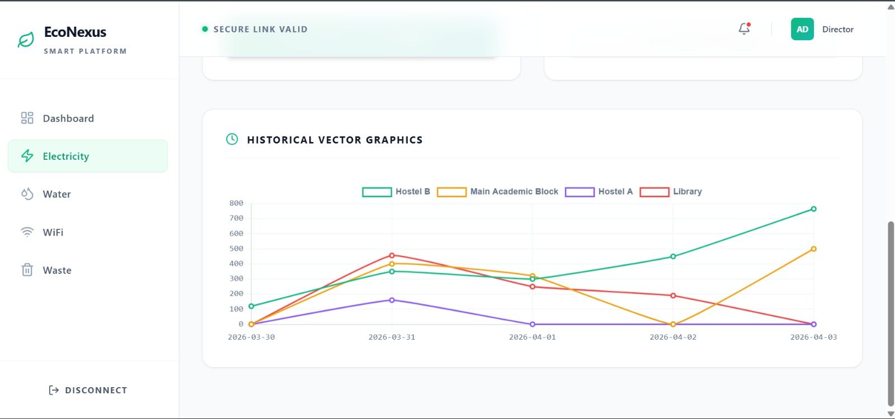

# Smart City Intelligent Resource Manager 🌆⚡💧🌐♻️

A full-stack intelligent platform designed to monitor, analyze, and optimize urban resource consumption using real-time dashboards, predictive analytics, and AI-powered sustainability insights.

This project aims to provide an intelligent digital ecosystem where institutions, campuses, smart cities, and organizations can monitor multiple resources from a unified dashboard and make data-driven decisions for better operational efficiency.

---

## 🚀 Project Overview

Smart City Intelligent Resource Manager helps cities, campuses, and organizations efficiently manage critical resources such as:

* ⚡ Electricity Usage
* 💧 Water Consumption
* 🌐 Internet Bandwidth
* ♻️ Waste Generation

The platform offers centralized monitoring, historical analytics, predictive intelligence, and actionable optimization suggestions for sustainable infrastructure management.

By integrating full-stack architecture with analytics-driven modules, the system creates a scalable smart resource intelligence platform suitable for future IoT expansion.

---

## ✨ Key Features

* 📊 Real-time resource monitoring dashboard
* 📈 Historical trend visualization with interactive graphs
* ⚡ Electricity consumption analytics
* 💧 Water usage tracking
* 🌐 WiFi bandwidth monitoring
* ♻️ Waste generation analysis
* 🔐 Secure system access and modular architecture
* 🤖 Machine learning-ready prediction module
* ⚠️ Resource anomaly observation support
* 🧠 Sustainability-oriented reporting interface

---

## 📷 Project Preview

### 🌿 Main Dashboard


### ⚡ Electricity Monitoring Module



### 📈 Historical Analytics Interface


---

## 🛠️ Tech Stack

### Frontend

* React.js
* Vite
* Tailwind CSS
* Chart.js / Data Visualization Components

### Backend

* Node.js
* Express.js
* REST API Architecture

### Database

* MongoDB

### Machine Learning

* Python
* Predictive analytics integration

---

## 📂 Project Structure

smart-city-intelligent-resource-manager/
│
├── client/ → Frontend application
├── server/ → Backend APIs and server logic
├── ml/ → Machine learning and predictive module

---

## ⚙️ Installation Guide

### Clone Repository

```bash
git clone https://github.com/aryanb342-jpg/smart-city-intelligent-resource-manager.git
cd smart-city-intelligent-resource-manager
```

### Frontend Setup

```bash
cd client
npm install
npm run dev
```

### Backend Setup

```bash
cd server
npm install
npm start
```

### Machine Learning Setup

```bash
cd ml
pip install -r requirements.txt
python main.py
```

---

## 🎯 Use Cases

* Smart Cities
* University Campuses
* Corporate Resource Management
* Sustainable Infrastructure Monitoring
* Institutional Utility Optimization

---

## 🔮 Future Enhancements

* IoT sensor integration for live physical data capture
* AI-based anomaly detection engine
* Automated alert generation system
* Cloud deployment support
* Mobile responsive monitoring dashboard
* Advanced predictive forecasting models

---

## 👨‍💻 Contributors

* Aryan Bhardwaj
* Anand Gupta

---

## 🌟 Vision

Building intelligent digital infrastructure for sustainable cities through data-driven resource optimization, smart analytics, and scalable monitoring systems.

This project represents a step toward future-ready digital sustainability platforms where resource intelligence directly supports environmental responsibility and operational excellence.

---

## 📌 Project Status

Project under active development 🚀
